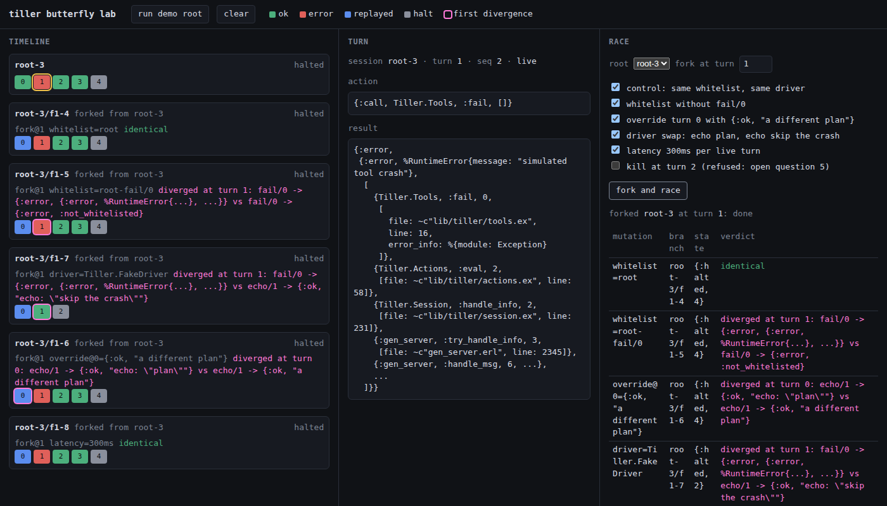
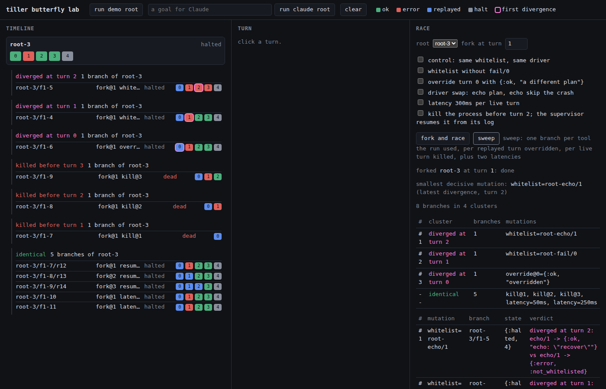

# tiller

A small agentic harness for Elixir. One loop, two modes: a session you drive
interactively, or a session that spawns supervised subagents. Subagents are
not a mode — they're a tool (`spawn_subagent`) in the parent's whitelist.

## Design

### The borrowed idea

From [lisptc](https://github.com/1hachem/lisptc) (neuro-symbolic LLM + small
Lisp runtime): constrain the model's action output to **data in a shared,
inspectable store**, so the trajectory is a diffable, replayable program —
not a pile of log strings.

We keep that property and drop the interpreter: in Elixir, a quoted term
*is* the AST, and evaluating it against a whitelisted set of functions gives
us lisptc's three claims with no runtime to maintain:

1. **Constrained output** — the driver emits a quoted MFA term, not free-form code. Garbage in → `FunctionClauseError`, not a half-executed script.
2. **Deterministic memory** — every action + result is appended to a single
   `Tiller.State` log. It is the audit trail, the replay log, and the source
   of the next prompt. One thing, three jobs.
3. **Bidirectional** — the loop is just `next_action(state) → eval → append → repeat`.

### Architecture

```
Tiller (DynamicSupervisor)
├─ Tiller.State            ← attributed event store (seq, session, parent, turn)
├─ Session (root)          ← you drive; tools: echo, spawn_subagent, seed_*
│   └─ Session (subagent)  ← LLM/fake-driven; smaller whitelist, no spawn
└─ Session (other tasks)
```

- **Session** (`Tiller.Session`): one GenServer per run, one turn per
  message. `run/1` is a cast; each turn asks the driver for the next action,
  evaluates it against the whitelist, appends a `Tiller.Event`, and schedules
  the next turn, so the process is observable between turns. `await/2`
  blocks on the halt event via `State.subscribe/1`. Crashes are contained: a
  tool that raises becomes `{:error, _}` in the log; a subagent runs
  concurrently under the supervisor and its parent keeps taking turns.
- **State** (`Tiller.State`): every session's every turn as a `Tiller.Event`
  with a global monotonic `seq`. `events(id)` is one trajectory;
  `Enum.take(events(id), n)` is the state at turn n, which is why forking
  needs no checkpointer. `subscribe(id | :all)` delivers each event live.
  With `config :tiller, state_log: path` every write is also appended to
  an on-disk log (`Tiller.State.Log`) and the store is rebuilt from it at
  start, so a VM restart loses nothing; `Tiller.Session.resume/1` (or
  `Tiller.Lab.resume_dead/0`) brings back the sessions it interrupted.
- **Divergence** (`Tiller.Divergence`): where two trajectories first part
  ways. A prefix walk with a normalizing equality (pids, refs, and stack
  traces are not divergence). The go/no-go spike for
  [the butterfly lab](docs/designs/agent-butterfly-lab.md); it passed.
- **Lab** (`TillerWeb.LabLive`): one page, three panes. Timeline of every
  session as turn chips, branches clustered under their root by outcome,
  the selected turn's action and result, and the race: pick a root and a
  fork turn, tick mutations (or sweep every axis point that could matter),
  watch the branches land live with their first divergence ringed and the
  smallest decisive mutation named.
- **Fork and race** (`Tiller.Session.fork/4`, `Tiller.Lab.race/4`): fork a
  session at any turn under one mutation (`whitelist`, `driver`,
  `result_override`, `latency`, `kill_at`), re-live the prefix through
  `Tiller.Driver.Replay` with recorded results injected and nothing
  re-executed, then run live. `race/4` forks N branches, runs them
  concurrently, reports each one's first divergence from the parent, and
  ranks them: later divergence is the smaller change, same turn on the
  same axis ranks by size, same turn on different axes ties.
- **Restart is resume**: a session's packet (driver, initial context,
  whitelist, lineage) lives in `Tiller.State` beside its events. When the
  supervisor restarts a killed session, `init/1` finds the packet and comes
  back as a new session forked from the dead one at the turn it died.
  A branch killed mid-run finishes identical to its parent.
- **Driver** (`Tiller.Driver` behaviour): the only seam for "where the next
  action comes from". `next_action/1` returns the next quoted term;
  `observe/2` (optional) folds each recorded result back into the
  driver's context; `resume_ctx/2` (optional) positions a driver at a
  fork or resume point. `Tiller.FakeDriver` scripts a list of actions for
  tests and demos. `Tiller.Driver.Claude` is the real one: the whitelist
  is offered as tools, a `tool_use` block becomes the quoted term, a reply
  with no tool call becomes a `note` event and the session halts. Raw HTTP
  over `:httpc`, `ANTHROPIC_API_KEY` from the environment, the server-side
  refusal fallback on by default. A Claude-driven session forks and
  resumes like a scripted one, because `resume_ctx/2` rebuilds the
  conversation from the replayed events.
- **Actions** (`Tiller.Actions`): the registry. The grammar *is* the
  capability boundary — an agent can only touch what's in its whitelist.
  Subagents get a smaller whitelist and can't spawn (depth limit).
- **Seed** (`Tiller.Seed`): an MCP stdio client for the
  [open-seed](https://github.com/shaunlmason/open-seed) engine. The `seed_*`
  tools (ready, get, claim, lease-renew, release, transition, evidence,
  comment) call the task port over JSON-RPC; the port's refusals come back
  as `{:refused, envelope}` with their exit class, so contention, a fenced
  token, or an invalid transition are results in the log, not crashes.
  Root sessions hold the worker verbs, subagents only the reads, and
  operator verbs are on no whitelist. Design and the deferred alternatives:
  [docs/designs/open-seed-integration.md](docs/designs/open-seed-integration.md).

### Deliberate limits (upgrade paths)

- Actions are flat MFA terms, no macros/macros-as-prompts. Add when a real
  LLM driver needs composability the whitelist can't express.
- `Tiller.State` persists through one append-only file, read whole at
  start. Fine for a lab; move to a table when the log outgrows memory.
- One turn per message; no concurrent tool calls within a turn. Add
  `Task.async_stream` when a single turn needs fan-out. Sessions themselves
  run concurrently.
- `Tiller.Driver.Claude` is tested against a scripted transport; the live
  test (`mix test --include live`) needs a key and has not run in CI. Two
  things to watch on first live use: a resumed conversation carries
  synthesised assistant turns without thinking blocks, and every tool
  takes one `args` array rather than named parameters.
- Only `kill_at` branches are resumed after a crash (`restart:
  :transient`); every other session is `:temporary`, so an ordinary
  crash stays a crash. Flip the child spec when you want the packet
  resume everywhere.

## Research

Projects looked at while shaping tiller, with the verdict on each.

- **[lisptc](https://github.com/1hachem/lisptc)**: borrowed. The
  "constrain action output to data in a shared, inspectable store" idea is
  the core of tiller (see The borrowed idea above).
- **[okf-agent-memory](https://github.com/okf-memory/okf-agent-memory)**:
  bookmarked, not adopted. A git-native project memory for coding agents:
  Markdown concepts with YAML frontmatter under `knowledge/`, following
  Google's Open Knowledge Format v0.2, plus a zero-dependency Go binary that
  validates the bundle, runs BM25 search, and exposes six tools over MCP
  (search, show, create, update, relate, validate). It solves cross-session
  knowledge, a different axis from `Tiller.State`, which is per-run
  trajectory state. Not adopted now because tiller has no LLM driver to read
  a memory, it would add a Go binary to a zero-dependency Elixir project, and
  `docs/*.jsonl` already serves as the agent memory for working on tiller.
  The project is very new (bundle dated late August 2026) and its benchmark
  claims against Mem0 and Letta are unlinked, so treat them as marketing.
  Possible future use: wrap `okf search` as a `Tiller.Tools` function once a
  real driver exists. A memory-read tool is a genuinely distinct tool, and
  "what if the agent could not consult memory at turn N" is a clean whitelist
  mutation axis for the butterfly lab.
- **[bb](https://github.com/get-bb/bb)**: looked at, not adopted. A
  TypeScript "agentic IDE": server, host daemon, web and desktop app, and CLI.
  It does not run agents itself; it wraps whichever provider CLI you have
  authenticated (Claude Code, Codex) behind a JSON-RPC bridge over
  stdin/stdout and shows the resulting threads live so you can steer or hand
  them off. Wrong layer for tiller, which is the loop rather than an
  orchestrator of opaque agent processes, and it would bring a Node toolchain
  with native add-ons to a zero-dependency Elixir project. It also does not
  solve the butterfly lab problem: threads are an append-only event stream,
  but there is no fork, no counterfactual replay, and no diff. Its record
  mode writes NDJSON of bridge traffic for parity testing, and its docs say
  deterministic re-execution is not a protocol feature. The one borrowable
  idea is the `thread/delta` vocabulary in
  `docs/provider-bridge-protocol.md`: a small set of semantic timeline events
  (turn.open, turn.boundary, item.open, item.close with a full item shape)
  rather than raw provider traffic. Worth a skim when the attributed event
  store that replaces the bare `{action, result}` list is designed.

## Status

The butterfly lab MVP: attributed event store, async sessions, replay,
fork under four mutation axes, divergence analysis, a LiveView to watch
the race, and the open-seed client. Run:

```sh
mix test
mix run -e 'Tiller.Demo.run()'          # root + subagent, a contained crash
mix run -e 'Tiller.Demo.butterfly()'    # one run forked five ways at turn 1, raced, compared
mix phx.server                          # the lab: http://localhost:4000
ANTHROPIC_API_KEY=... mix run -e 'Tiller.Demo.claude("Call echo with \"ping\", then stop.")'
```

The lab in action, forked at turn 1 under five mutations: the timeline on
the left shows each branch's turns as they land (blue = replayed prefix),
the middle pane is the selected turn, and the race on the right reports
where each branch first diverged from its parent.



A sweep of the same run: every tool it called removed one at a time, the
replayed turn overridden, a kill before each live turn, two latencies;
the branches land as clusters by outcome.



Dependencies are Phoenix and LiveView (with PubSub, Bandit, Jason), added
for the lab's screen and nothing else: no Ecto, no asset pipeline, the
client JS is served from the packages themselves.

Against a real open-seed repo (one you instantiated from the template, with
its `scripts/seed` shim and a ready card):

```sh
mix run -e 'Tiller.Demo.seed("os-<id>", cd: "../my-seed-repo", actor: "tiller-1")'
```

The integration test builds a throwaway repo on the engine's local SQLite
backend and drives the real `seed mcp serve`:

```sh
test/support/seed_fixture.sh ../open-seed /path/to/seed /tmp/seed-fixture
TILLER_SEED_CMD="/path/to/seed mcp serve" TILLER_SEED_DIR=/tmp/seed-fixture \
  mix test --include integration
```
